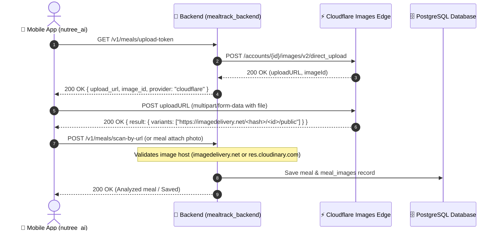

# Cloudflare Images Guide & Runbook

This document details the architecture, configuration, mobile upload flow, and operational procedures for **Cloudflare Images** in `mealtrack_backend` and the `nutree_ai` Flutter client.

---

## 1. Architecture Overview



### Key Architectural Characteristics
- **Zero Backend Bandwidth Bottleneck**: The backend never proxies large image binary streams; clients upload directly to Cloudflare's nearest edge data center.
- **Zero-Downtime Dual-Provider**: The backend and mobile client simultaneously support both Cloudflare Images (`imagedelivery.net` or custom domain) and legacy Cloudinary (`res.cloudinary.com`).
- **Instant Rollback**: Setting `IMAGE_STORE_PROVIDER=cloudinary` instantly switches future uploads back to Cloudinary without code changes or restarts.

---

## 2. Environment Configuration

### Minimal Required Settings (`.env`)

Cloudflare Images automatically reuses your existing `CLOUDFLARE_ACCOUNT_ID` and `CLOUDFLARE_API_TOKEN` configured for Workers AI. You only need to add `CLOUDFLARE_ACCOUNT_HASH`:

```bash
# Provider toggle: 'cloudflare' (default) or 'cloudinary'
IMAGE_STORE_PROVIDER=cloudflare

# Reuses existing Cloudflare credentials:
# CLOUDFLARE_ACCOUNT_ID="<your_cloudflare_account_id>"
# CLOUDFLARE_API_TOKEN="<your_cloudflare_api_token>"

# Required: unique account hash from Cloudflare Images Dashboard
CLOUDFLARE_ACCOUNT_HASH="PeQb0oPRIbwHNu4iebuEpQ"

# Optional: default variant (defaults to "public" if omitted)
CLOUDFLARE_DEFAULT_VARIANT="public"

# Optional: custom delivery domain (leave empty to use https://imagedelivery.net/...)
CLOUDFLARE_CUSTOM_DOMAIN=""
```

---

## 3. Cloudflare Dashboard Setup

### Step 1: Ensure API Token Has Images Permissions
1. Navigate to **Cloudflare Dashboard → My Profile → API Tokens** (`https://dash.cloudflare.com/profile/api-tokens`).
2. Select your active token (configured as `CLOUDFLARE_API_TOKEN`).
3. Under **Permissions**, verify or add:
   - **Account** → **Cloudflare Images** → **Edit**
4. Save the token.

### Step 2: Retrieve Your Account Hash
1. In Cloudflare Dashboard, navigate to your Account → **Images** (`https://dash.cloudflare.com/<account-id>/images`).
2. Look for the **Account Hash** displayed on the right sidebar (or in the sample delivery URL `https://imagedelivery.net/<ACCOUNT_HASH>/...`).
3. Set this value as `CLOUDFLARE_ACCOUNT_HASH` in `.env`.

### Step 3: Configure the `public` Delivery Variant
1. In Cloudflare Dashboard, go to **Images → Variants**.
2. Create or verify a variant named `public`:
   - **Variant name**: `public`
   - **Resize rule**: `Scale down` (or `Fit`)
   - **Maximum width**: `1024px` (or `768px`)
   - **Format**: Auto (`f=auto` delivers WebP or AVIF automatically depending on client device support)
   - **Quality**: `85`
3. Save the variant.

### Step 4 (Optional): Custom Delivery Domain via URL Rewrite
By default, Cloudflare serves images via `https://imagedelivery.net/<ACCOUNT_HASH>/<IMAGE_ID>/<VARIANT>`.

If you prefer branded URLs such as `https://images.nutree.ai/<image_id>/<variant>`:
1. **Ensure Domain Proxying**:
   - In Cloudflare DNS, add a DNS record for your subdomain (e.g., `images.nutree.ai`) pointing to your zone origin or dummy IP (e.g. `192.0.2.1`).
   - Ensure the Proxy Status is set to **Proxied** (orange cloud ☁️).
2. **Configure URL Rewrite (Transform Rule)**:
   - In the Cloudflare Dashboard, select your domain zone → **Rules** → **Transform Rules** → **URL Rewrite**.
   - Click **Create rule**:
     - **Rule name**: `Cloudflare Images Custom Domain Rewrite`
     - **When incoming requests match**:
       - Field: `Hostname` | Operator: `equals` | Value: `images.nutree.ai`
     - **Path Rewrite**:
       - Select: **Dynamic**
       - Expression: `concat("/cdn-cgi/imagedelivery/<ACCOUNT_HASH>", http.request.uri.path)`
         *(Replace `<ACCOUNT_HASH>` with your actual 22-character account hash)*
   - Click **Deploy**.
3. **Configure Environment**:
   - Set `CLOUDFLARE_CUSTOM_DOMAIN="images.nutree.ai"` in `.env`.
   - The backend and mobile app will now construct and accept `https://images.nutree.ai/<image_id>/public`.

---

## 4. Cloudflare Images Best Practice Checklist

| Category | Cloudflare Best Practice | MealTrack Implementation |
|---|---|---|
| **Security** | Never expose API tokens to mobile / browser clients | ✅ Presigned direct upload tokens (`/v2/direct_upload`) generated server-side |
| **Token Scopes** | Least privilege API tokens | ✅ Scoped strictly to `Account → Cloudflare Images: Edit` |
| **Single-Use URLs** | Direct upload URLs must be one-time use | ✅ New upload URL generated per scan via `/v1/meals/upload-token` |
| **URL Expiry** | Bounded between 2 minutes (120s) and 6 hours (21,600s) | ✅ Set to 300s (5 minutes) with `max(120, ttl)` lower-bound |
| **Custom Image IDs** | Use UUIDs to correlate uploads before client completes | ✅ Backend pre-assigns `uuid.uuid4()` as Cloudflare image `id` |
| **File Constraints** | Max 10 MB per image; JPEG/PNG/WebP/GIF | ✅ Mobile compresses photos before upload; backend normalizes MIME types |
| **Edge Optimization** | Use `f=auto` and `fit=scale-down` for CDN compression | ✅ `to_compressed_image_url` applies `w=768,fit=scale-down,f=auto` |
| **Delivery Caching** | Cache variants at Cloudflare edge data centers | ✅ Immutable edge caching on variants; zero origin hits after first render |


---

## 5. Mobile Client Implementation (`nutree_ai`)

The mobile client handles both providers transparently via `CloudinaryUploadService` (aliased as `ImageUploadService` in `lib/features/meal_scanner/data/services/cloudinary_upload_service.dart`):

1. **Token Fetch**: Calls `GET /v1/meals/upload-token`.
2. **Provider Detection**:
   - If `token.uploadUrl` is present: performs a direct multipart `POST` to Cloudflare Direct Upload URL. Parses `result.variants.first` or `result.id`.
   - If `token.uploadUrl` is absent (legacy backend or rollback): executes legacy Cloudinary signed upload to `https://api.cloudinary.com/v1_1/<cloud_name>/image/upload`.
3. **Progress Reporting**: Streams byte transfer progress through Riverpod state (`meal_upload_progress_provider`).

---

## 6. Offline Database Migration

To migrate historical meal photos from Cloudinary (`res.cloudinary.com`) to Cloudflare Images (`imagedelivery.net`), use `scripts/migrate_cloudinary_to_cloudflare.py`:

```bash
# 1. Dry run to inspect how many images need migration without writing to DB or Cloudflare
uv run python scripts/migrate_cloudinary_to_cloudflare.py --dry-run

# 2. Test migration on a small subset (e.g. 5 meals)
uv run python scripts/migrate_cloudinary_to_cloudflare.py --execute --limit 5

# 3. Execute full batch migration in production / staging
uv run python scripts/migrate_cloudinary_to_cloudflare.py --execute --batch-size 50
```

### Migration Script Behavior
- Queries `meal_images` records matching `%res.cloudinary.com%`.
- Downloads image bytes from Cloudinary.
- Uploads image to Cloudflare Images using `image_id`.
- Obtains the Cloudflare delivery URL and updates both `meal_images.url` and corresponding `meals.image_url`.
- Commits transaction per batch.

---

## 7. Rollback & Troubleshooting

### Emergency Rollback
If Cloudflare Images encounters an outage or configuration failure:
1. In your deployment environment, set:
   ```bash
   IMAGE_STORE_PROVIDER=cloudinary
   ```
2. Restart the backend service. All new upload tokens will revert to Cloudinary signed uploads. Existing Cloudflare images in the database will still load properly since `meal_scan_by_url` and `meals_edit` allow both hosts.

### Common Error Codes

| Symptom | Cause | Solution |
|---|---|---|
| `403 Authentication error (code 10000)` on direct upload | `CLOUDFLARE_API_TOKEN` lacks Images permission | Add **Cloudflare Images: Edit** permission to the token in Cloudflare Dashboard. |
| `422 INVALID_IMAGE_URL` on scan-by-url | Host not in allowed list | Ensure the URL hostname is either `imagedelivery.net` or matches `CLOUDFLARE_CUSTOM_DOMAIN`. |
| Missing Account Hash error on startup | `CLOUDFLARE_ACCOUNT_HASH` is empty | Copy account hash from Cloudflare Images dashboard and add to `.env`. |
