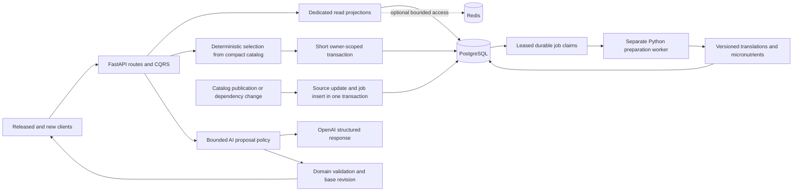

# Weekly meal plan backend optimization — implementation solution

Date: 2 October 2026. Status: ready for implementation planning; application changes are not implemented.
Audience: backend, database, AI, infrastructure and QA engineers. Scope: backend weekly planner and its client compatibility contract; mobile rendering optimization is a separate workstream.

## 1. Decision and implementation order

Keep FastAPI, the four Clean Architecture layers, CQRS, PostgreSQL and the current AI provider adapters. Give reads dedicated projections, keep authoritative writes short and atomic, and prepare shared catalog data in a durable Python worker.

The user explicitly generates the current week. Store the result and serve subsequent reads from persisted state. Catalog preparation can run ahead of requests; user plans are not generated on a schedule.

| Work package | Deliverable | Dependency | Suggested owner |
|---|---|---|---|
| [1. Baseline and guards](./phase-01-baseline-and-contract-guards.md) | Production/staging baseline, contract characterization, actual pool configuration | None | Backend lead + infrastructure |
| [2. Narrow reads and batching](./phase-02-narrow-reads-and-batching.md) | Compact plan reads, selected-recipe validation, reused grocery inputs | 1 | Backend read/write engineer |
| [3. Catalog and generation](./phase-03-catalog-projections-and-generation.md) | Versioned projections, SQL browsing/index evidence, shorter generation commit | 2 | Backend + database engineer |
| [4. AI policy](./phase-04-ai-request-policy.md) | Dedicated OpenAI planner policy, deadline, shortlist, evals | 3 interface agreement | AI engineer |
| [5. Catalog preparation](./phase-05-durable-catalog-preparation.md) | Persisted translations and durable enrichment jobs | 3 version contract | Worker + infrastructure engineer |
| [6. Verify and roll out](./phase-06-verification-and-rollout.md) | PostgreSQL/load/correctness evidence, staged cutover and rollback | All | QA + release owner |

Packages 4 and 5 can proceed in parallel after the catalog contracts are stable. One integrator owns changes to shared planner services, routes, dependency wiring and schemas. Other engineers work in separate modules; sequence overlapping file edits. Deliver package 2 independently rather than waiting for all preparation work.

## 2. Evidence and boundaries

The [source review](../reports/meal-plan-performance-review-2026-10-02.md) examined backend revision `00b6eaa6`. Rebase and recheck these findings before implementation.

| Verified locally | Implication |
|---|---|
| Basic plan read issued 8 SELECTs in an isolated SQLAlchemy/SQLite fixture | Remove catalog relationships discarded by the plan mapper |
| Current plan with cold summaries and grocery count combined 30 SELECTs in that fixture | Reuse plan/catalog inputs; make count work explicit |
| Generation, swaps and AI proposals load the active catalog | Use operation-specific projections and requested IDs |
| Generator median at 10,000 synthetic recipes was 822 ms, excluding loading/mapping | Precompute stable features and measure event-loop occupancy |
| Catalog presentation can call OpenAI during cold non-English reads | Persist translations; GETs use DB/cache with canonical fallback |
| AI uses purpose `general`, first 200 recipes and sequential provider attempts | Give planner requests their own policy and eligible shortlist |
| Pantry/grocery writes prefetch state and flush once | Bulk DML is a benchmark candidate, not a confirmed per-item SELECT issue |
| Neon mode can choose a queue pool while omitting its configured arguments | Fix configuration before sizing connections/workers |

These are source/local findings, not production latency results. Live catalog size, SQL plans, database round-trip time, deployed provider routing, cache hit rates, pool settings and concurrency are measurement tasks in package 1.

Preserve these invariants throughout:

- Owner-scoped reads/writes; one Monday-based plan per user/week; exactly 14 stable lunch/dinner coordinates.
- Explicit current-week generation; retain existing historical read behavior and future-week rejection.
- Backend calorie authority: `P*4 + (C-fiber)*4 + fiber*2 + F*9`, with existing calculator exceptions and conversion rules.
- Hard allergy/diet/dislike, publication and nutrition eligibility semantics; existing saved-profile semantics must survive AI changes.
- Logged slots cannot be replaced; portion logging creates one durable meal under replay/concurrency.
- Request fingerprints, idempotency replay, optimistic revisions and transaction ownership by the UoW.
- Grocery checkboxes, exclusion, pantry quantities and Undo remain distinct and survive fresh reads.
- Existing three-day recommendations and their Node worker event contract retain their behavior.

## 3. Target architecture



Domain owns calculators, constraint rules and selection. Application services orchestrate ports and UoWs. Infrastructure owns SQL projections, caches, provider policy transport and worker persistence. API maps results and declares compatibility; it does not execute catalog SQL or own provider workflows.

CQRS `send()` awaits a handler in the API process. Sending a command does not make it a background job.

## 4. Endpoint contracts and compatibility

| Endpoint | Target critical path | Compatibility rule |
|---|---|---|
| `GET /v1/meal-plans/current` | Persisted plan + slots + compact summaries | Read-only mode uses existing `auto_generate=false`; preserve legacy auto-generation until clients migrate |
| `POST /v1/meal-plans/generate` | Budget/context, deterministic selection, atomic persistence, compact response | Current week only; existing idempotency and draft/confirmed rules |
| `PATCH /v1/meal-plans/{id}` | Requested recipe validation, revision-checked write, compact response | Preserve response schema and logged-slot conflicts |
| `GET /v1/recipes` | SQL filters/count/order/page over compact projection | Preserve search, sort, diet/allergy/dislike and pagination results |
| `GET /v1/recipes/{id}` | One detail projection + persisted translation/enrichment | No translation/USDA/AI provider calls |
| `GET /v1/meal-plans/{id}/groceries` | One plan load + selected ingredient projection + pantry/state | Preserve ordering, quantities, flags and fallback ingredient identity |
| Grocery PATCH and slot-log POST | Short owner-scoped transaction | Preserve replay, partial update semantics and fresh-read results |
| `POST /v1/meal-plans/{id}/ai-prompt` | Context + eligible shortlist + bounded OpenAI call + domain validation | Proposal only; apply remains a separate revision-checked PATCH |
| Deprecated micronutrient POST | Same persisted recipe detail read | Keep cache-only compatibility behavior |

Today GET defaults `auto_generate=true`, and released Flutter explicitly sends true. Do not silently change its behavior. First ship all read optimizations without changing defaults. A subsequent client release must use false for hydration and POST for the generation action. Observe version/caller usage, then retire the compatibility path through an explicit contract rollout. Changing the default alone does not migrate callers that send true.

Keep current response fields. Optional metadata, such as preparation status or source revision, must be additive and validated against released clients. Keep grocery-count defaults compatible initially; new clients already can explicitly disable counts. No new `202` plan-generation contract is required for this solution.

## 5. Read models, batching and catalog versions

### 5.1 Plan and selected recipes

- Add a query-specific plan read returning only persisted plan fields and slot state. Suppress slot-to-catalog, pantry and nested food-reference hydration on this path.
- Batch distinct selected recipe IDs once. Read summary columns directly; do not build full `CatalogMeal` objects and then discard ingredients/steps.
- Initial query-count target: at most 3 feature SELECTs for a saved plan with cold summaries and count disabled, below loader batching thresholds. Count auth/profile/budget, cache and grocery work separately; the target must be proved on PostgreSQL.
- If groceries/count are requested, pass the already loaded plan into the projection service. Derive count from the same grocery result rather than issuing another plan query.
- A swap fetches requested replacement IDs. When hard preferences change, validate the final unlogged recipe set, including unchanged recipes. Reuse existing domain constraints.
- Treat missing/inactive recipes as explicit results of the batch load. Avoid repeating a single-recipe query for every missing ID unless a distinct legacy fallback is required and tested.
- Each concurrent DB task has its own `AsyncSession`; prefer set-based SQL within one UoW over parallel calls on a shared session.

### 5.2 Catalog projection contract

Keep normalized source tables authoritative. Introduce a rebuildable, typed per-recipe projection with queryable columns; JSON is acceptable only for a rebuildable payload that is not searched or filtered.

| Projection | Required fields |
|---|---|
| Selection/list | Recipe ID, source version, name/tag/cuisine, images, slot flags, time/rank, active/publication/nutrition status, canonical macros/calories, normalized matching features and allergen links |
| Ingredients | Recipe ID/version, ordered quantities/units, canonical or fallback ingredient identity, conversion information and grocery category |
| Detail | Selected recipe metadata, ingredients, steps and persisted preparation overlays |

Represent repeated/filterable allergens through links or a correctly versioned canonical join. Do not replace canonical allergy checks with translated descriptions or a provider assertion.

Define `source_version` from every dependency that changes the projection: recipe content/publication, ingredient quantities, referenced food nutrition, serving/unit conversions, allergen registry/links and calculator/projection contract version. Recipe `content_hash` alone is insufficient when referenced nutrition changes. Use dependency facets for selection/macros, ingredients, translation and enrichment; hash relevant field values/revisions rather than every food-reference `updated_at`. A micronutrient-only update must not invalidate selection macros, and writing an estimate must not invalidate itself. Translation versions additionally include locale and translation contract; enrichment versions include provider/estimator contract.

Mandatory filter/order/count/eligibility columns and canonical allergen links are refreshed synchronously with published source changes. They cannot wait for an optional worker. Dirty macro/ingredient payloads are rebuilt from authoritative inputs only for selected page/plan IDs after SQL filtering, preserving the complete result set and page total. Never omit dirty recipes or invent a preparation response for the existing list endpoint. New selection must refresh dirty candidate nutrition before ranking; during initial backfill retain the authoritative legacy selection path until complete projection parity permits cutover. Stage large catalog publications before activation, and measure mandatory dependency-update fanout before rollout. Translation may fall back to canonical text; micronutrients may remain pending. Withdrawn recipes are rejected immediately, even if an older cached snapshot exists.

Use a small publication revision record updated with authoritative catalog/dependency changes for snapshot invalidation, rather than an ingredient-graph aggregate on every generation. Any rebuild/activation must verify its captured dependency version before becoming current.

Adapt [CatalogMealSnapshotService](/Users/alexnguyen/Desktop/Nut/mealtrack_backend/src/app/services/catalog_meal_snapshot_service.py:33) for revision-aware reuse and one refresh per process. Its existing full domain tuple, TTL and last-good fallback are not a persisted compact projection; safety/withdrawal checks cannot depend solely on its TTL.

### 5.3 SQL browsing and indexes

Move filtering, stable ordering, count and pagination into the repository. Preserve the current Python result set first: test casefold behavior, null cook times/ranks, title exclusions, diet/allergen/dislike rules, empty pages and ties. Use a normalized matching column where Python casefold and database lower/collation differ. Apply all eligibility filters before LIMIT. Keep existing offset API; add keyset pagination only when depth measurements justify a compatible extension.

| Index area | Implementation decision |
|---|---|
| User/week, slot coordinate, pantry/state, idempotency | Existing compound indexes/constraints cover core lookup patterns; verify deployed definitions and use |
| Cuisine | Current `lower(cuisine)` does not directly match raw cuisine index; evaluate matching normalized/expression key, optionally partial on active rows |
| Browse ordering | Match actual active/filter + rank + normalized name + ID ordering; do not assume the raw-name index satisfies `lower(name)` sorting |
| Substring search | Evaluate `pg_trgm` GIN on actual normalized searched fields after SQL filtering exists; preserve short-term/empty query behavior |
| Job polling | Match ready/next-attempt ordering and expired-lease recovery; no volatile `now()` expression in an index predicate |

Capture before/after `EXPLAIN (ANALYZE, BUFFERS)` for representative SELECTs and row distributions. A sequential scan can be appropriate for small/low-selectivity sets. Add only indexes that improve the measured query; retain uniqueness constraints and account for write/index size cost. Generate migrations through the repository CLI, never hand-create revisions. For a large live table, use the migration framework's supported nontransactional concurrent-index path and account for failed invalid indexes; do not run `CREATE INDEX CONCURRENTLY` inside an ordinary transaction.

### 5.4 Writes and caches

Grocery writes already prefetch pantry/state and flush once. First narrow the lock/load to necessary rows. Compare actual SQL round trips and statement counts before introducing bulk upsert; preserve ownership, partial field intent, conflict keys and replay. Group homogeneous rows, bound batch size to the existing 100-update request limit, and avoid bypassing domain side effects.

Use separate cache namespaces for summary, detail and translation, keyed by recipe source/dependency version and schema version; translations also include locale. Old cache payloads must not overwrite newer projections. Redis remains optional: an initial total read-through cache budget of 100 ms covers read and attempted write together; bypass writes during degradation and fall back to PostgreSQL.

Do not cache personalized grocery results until their key/invalidation includes plan revision, ingredient source versions, pantry quantity/unit version and grocery interaction version. Checkbox/exclusion changes currently need not change plan revision. Begin with batching/reuse and no new grocery cache; add revision tracking and caching only with parity tests.

## 6. Deterministic generation and transaction protocol

Cache stable features such as normalized title/tag, title eligibility, slot suitability, canonical allergen codes and derived nutrition by source version. Compute user preferences and user/week/coordinate-dependent ranks per request. Preserve the current algorithm output; prove parity before removing sort/scans or changing tie-break evaluation. A changed selection policy requires a new algorithm version and intentional rollout.

Use this transaction design after package 2 is stable:

1. Read cheap replay/current state and capture the plan, constraint and catalog versions. Return known replay or confirmed-plan conflict before catalog work where current semantics allow it.
2. Load matching compact candidates and select outside the final write lock/transaction. Bound CPU work; record catalog-load, projection and selection time separately.
3. Start the final UoW. Lock the active publication-revision row `FOR SHARE`, then acquire a stable transaction-scoped advisory lock for the owner/week, including when no plan row exists. Every canonical publisher must take `FOR UPDATE` on that revision row before changing relevant dependencies and advance the revision in the same transaction. Hold the shared lock through selected validation and commit. Retain the unique owner/week constraint as the last guard; never use Python's randomized `hash()` as the cross-process advisory key.
4. Reserve/recheck the idempotency operation in this final transaction, then reload and lock current state. A replay returns the persisted result. If moving reservation later changes observable in-progress timing, characterize that behavior and retain the existing path until concurrency tests pass; do not commit an abandoned reservation during precomputation.
5. Lock relevant slots in coordinate order and verify captured plan/context state, slot versions and selected recipes' current source versions, publication/constraint validity and logged coordinates. Mutations needing both resources use publication lock → owner/week or plan lock → slot locks consistently. Slot logging currently increments only `slot.version`; capture/revalidate that version and make logging follow the compatible locking order. Preserve public plan-revision behavior for released clients rather than silently bumping it on logging. A catalog revision reread without the shared publisher lock is not sufficient.
6. On concurrent plan change, return the existing conflict response instead of overwriting newer state. On catalog version change, allow at most one fresh bounded selection restart; then return a retryable conflict. Restart outside the lock.
7. Create/update the plan, complete the idempotency record and commit atomically. Release the DB connection before presentation/cache work; provider calls never run inside this transaction.

Test same-key and different-key missing-week creation, aborted calls, replay, simultaneous draft regeneration, swap versus log, and hard preference changes. Existing row locks alone do not serialize an absent user/week row. A source-version check is effective only if publishers and final validation participate in the same serialization/version protocol.

Keep ordinary generation synchronous initially. If representative load still shows event-loop stalls after reducing work, move CPU selection to a bounded process executor with immutable input and the same final commit protocol. Evaluate a durable accepted/status generation API only as a separate measured need.

## 7. AI engine and adjustment policy

Reuse the existing provider adapters, cached clients, strict structured output, circuit breakers and cache usage metrics. Add a dedicated `meal_plan_adjustment` purpose through [ModelPurpose](/Users/alexnguyen/Desktop/Nut/mealtrack_backend/src/domain/model/ai/model_purpose.py), [PURPOSE_MAP](/Users/alexnguyen/Desktop/Nut/mealtrack_backend/src/infra/adapters/meal_generation_service.py:13), [manager](/Users/alexnguyen/Desktop/Nut/mealtrack_backend/src/infra/services/ai/ai_model_manager.py:76) and dependency wiring. Configure it explicitly for OpenAI, with no inheritance from `general` or Cloudflare text-purpose settings.

| Policy | Initial implementation default | Validation |
|---|---|---|
| Overall request deadline | 30 seconds, starting at endpoint entry | Includes context/admission/provider/retries/validation/projection; below existing mobile 60-second timeout |
| Provider portion | At most 25 seconds and never beyond remaining overall time | Async cancellation plus transport timeout; leave time for validation/response |
| Retry | One engine-controlled transient retry maximum, only within remaining provider budget; planner SDK automatic retries disabled | Retry eligible 429/connection/5xx cases; honor Retry-After only when it fits; do not retry permanent input/auth failures |
| Candidate budget | Start with a maximum of 40 ranked eligible candidates; tune with evaluation | Resolve explicitly named candidates before capping; preserve requested scope and feasible soft preferences |
| Output | IDs/actions for requested changes plus one concise localized explanation | Scope-aware strict schema; measure actual generated tokens, not only the max-token setting |
| Admission | Configured capacity per purpose/provider, bounded wait, total capacity across replicas | Interactive and preparation budgets separate; reject excess through existing error envelope |

These are tunable engineering defaults, not measured production SLOs. A candidate cap is a prompt budget, not a restriction on the supported catalog. Retrieval must find named/out-of-shortlist recipes and preserve feasible constraints. Widen once within the deadline when retrieval indicates truncation excluded feasible matches; otherwise return the established unsupported/no-feasible-proposal behavior rather than inventing a recipe.

Keep canonical IDs and constraints independent of localized text. Ask OpenAI to produce explanation copy in the requested locale in the same structured result. Localize static recipe display through persisted translations. Backend validation still checks every proposed ID, scope, eligibility and logged slot; structured JSON is not proof of domain validity.

The plan can change while OpenAI runs. Return `base_revision` from captured input and map it to existing PATCH `expected_revision`; current Flutter already does this. Require this mapping in the AI-client contract and reject mismatched supplied revisions. Generic legacy PATCH permits omission and cannot infer that a body came from AI; retain that compatibility instead of silently making the field globally mandatory. Every apply also revalidates current target-slot logged/version state and selected recipe eligibility, since logging does not necessarily change plan revision. A later universal revision requirement needs its own caller migration. Proposal generation never writes a meal or applies a slot change, including after cancellation/deadline expiry.

Own retries at one layer. Cache planner clients by their fixed model/timeout/retry policy so the new planner policy does not mutate shared defaults for parsing, vision or other features. Propagate remaining time to attempts. Existing AI code already releases its UoW before provider calls; preserve it.

Admission must be bounded across the deployment. With fixed replicas, explicitly allocate each replica a share and validate worker-count × per-process concurrency against the total budget. Before autoscaling, use a shared lease-based admission mechanism; PostgreSQL can hold fixed provider/purpose admission slots without making optional Redis required. Release admission and DB connections on success, error and cancellation; leases recover crashed callers.

Stable shared instructions precede dynamic plan/user context for prompt caching. Reuse the existing safe cache-key policy, verify the selected model's current API support and cacheable-prefix rules, and measure cached tokens/input tokens plus latency/cost. This caches prompt processing, not personalized proposals. A smaller prompt helps cost/quality but does not guarantee proportionate latency reduction; reduce sequential calls and actual output too.

Evaluate the existing OpenAI model before changing it. Test English/Vietnamese, meal/week scope, named recipes, restrictive diets/allergies, unsupported requests, missing/inactive recipes, logged slots and stale revisions. Report p50/p95, timeout/fallback rates, tokens and valid/useful proposal rate. Backend safety violations must be zero; compare usefulness against the current implementation. Offline evaluation can use Batch API; interactive proposals use the standard API.

## 8. Durable catalog preparation

### 8.1 Baseline worker design

Implement a typed PostgreSQL catalog preparation job table and a separate Python worker deployment that reuses the existing Python translation and micronutrient services. Jobs are catalog-owned, not user-plan records. The Node `nutreeai_async` worker cannot execute these Python services or own weekly planner persistence without a new contract and implementation.

Insert jobs in the same UoW as catalog/dependency changes. The durable SQL row is the work authority; optional Cloudflare queue notifications only wake consumers and may be lost without losing work. This avoids relying on the current direct post-commit publication path's documented loss window. A separate outbox is unnecessary when the committed job row itself is the durable queue.

Suggested typed job fields: ID, task type, recipe FK, dependency version, non-null locale scope, contract version, state, attempt count, next attempt timestamp, lease owner/token/expiry, created/updated timestamps and bounded error code. Unique key: `(task_type, recipe_id, dependency_version, locale_scope, contract_version)`. Use a non-null sentinel locale for nontranslation tasks so SQL NULL uniqueness does not defeat deduplication.

Transitions: `pending -> running -> succeeded`; retryable failure becomes `retry_wait`; exhausted/permanent failure becomes `failed`; changed-source work becomes `superseded`. Preserve failure metadata and a controlled retry operation. UI-facing readiness uses existing recipe status contracts; job lease/token/internal errors are not exposed.

- Claim a small batch of due jobs with `FOR UPDATE SKIP LOCKED`; commit/release the connection before provider work. Admission and lease timing must be coordinated: do not accumulate running jobs waiting behind provider admission.
- Cap provider concurrency across worker processes and API traffic using separate allocated budgets. Set per-attempt deadlines below renewable lease coverage; heartbeat only while owned and fence completion by lease token/generation.
- Write enrichment/translation and complete the owned job transactionally only if the captured source version is still current. An old worker cannot overwrite new content after expiry or supersession.
- Retry transient failures with exponential backoff/jitter and a finite attempt count; persist next-attempt state. Failure/queue-age alerts identify stalled catalog readiness.
- Use worker batch polling with backoff or notifications. Remove repeated half-second per-recipe polling from API background work.
- On startup/backfill, enqueue missing versions idempotently in bounded pages. Catalog/generate/update commands may enqueue missing preparation transactionally. GET queries return canonical/pending data without enqueueing work or calling providers; worker reconciliation of dirty versions covers missed legacy preparation.

### 8.2 Translations and nutrient readiness

Persist translations by recipe/source version, locale and translation contract. Prefer authored translations; validate machine output and completeness. Summary reads request only displayed fields; detail can read the matching full translation. On missing/failed translation return canonical content while the worker prepares it. Never present fallback as a complete translation or use translated allergy copy for eligibility.

Refactor enrichment before connecting the worker: the existing service owns inner UoWs/claims and catches failures, so calling it unchanged cannot provide atomic job/result completion. Extract provider computation that returns typed `ready`, `retryable_failure`, `permanent_failure` or `superseded` outcomes, validated payload and any staged canonical nutrient updates. It must not claim work, commit results or hide failures. A worker-owned final UoW verifies input/source and job token, applies staged canonical updates through the publisher protocol when needed, writes the matching output-version overlay and completes the job atomically. Intentional canonical updates must produce a defined output version and invalidate affected dependents without making the result supersede itself.

Keep the existing micronutrient value table, adding dependency/contract version columns and uniqueness through expand/backfill migration. Its current `(recipe_id, content_hash)` key is insufficient for dependency freshness. Do not assign a new valid version to old estimates without proving their input provenance; new reads treat unverified rows as pending. The job lease becomes execution authority; retire inner enrichment claims/polling after all producers use it. During rolling overlap, both schedulers must go through one compatible claim protocol. Macros/calories remain available while optional micronutrients prepare.

Switch off FastAPI enrichment scheduling only after durable producer, backfill, worker completion and readiness are verified. During overlap, ensure both paths use the same deduplication/fencing contract. Do not strand pending recipes or falsely mark all nutrients ready.

## 9. Measurement and acceptance

Record deploy revision, pool class/effective settings, worker counts, catalog size, schema/index revision, source/preparation version and test traffic conditions with every comparison. Trace auth, budget, DB checkout/query/map, selection, lock/commit, Redis, provider attempts, validation, localization, groceries and readiness separately. Logs/metric labels contain no tokens, prompts, user content, food payloads or secrets; avoid high-cardinality IDs in metrics.

| Gate | Required evidence |
|---|---|
| Saved-plan read | Core query budget proved on PostgreSQL; no discarded catalog graph; no provider calls |
| Catalog growth | Same browse page loads bounded rows; swap cost follows affected IDs; selection CPU measured at actual and forecast size |
| Eligibility/nutrition | Matching source-version dependency coverage; existing constraint/calorie parity; withdrawn recipe rejected |
| Cache degradation | Redis disabled/slow/down returns DB-backed data within configured optional budget; no stale cross-version overlays |
| Concurrency | Same/different-key generation, swap/log, pantry replay and stale proposal apply have correct persisted outcomes |
| AI | Overall deadline/attempt caps, bounded admission, zero backend safety violations, useful-proposal quality and token/latency report |
| Worker | Crash/restart, duplicate job, expired lease, superseded source, retry exhaustion and recovery produce correct durable readiness |
| Compatibility | Released GET behavior and new explicit POST flow; current/past/future week and response shapes checked |

Use the existing release SLO if one is documented. If absent, publish the baseline first and use these provisional server-side engineering goals under the agreed staging load: saved-plan read without count p95 ≤300 ms; recipe page p95 ≤400 ms; groceries p95 ≤500 ms; ordinary generation p95 ≤1.5 s; AI terminal response within the 30-second deadline. These exclude client/network rendering, include normal server dependencies, and must be revised transparently if geography/auth or measured load makes them unsuitable. Do not declare release success using invented thresholds or an idle single-request run.

Start non-AI mixed load at 50 concurrent users for 10 minutes, then repeat at the measured peak and agreed headroom; 50 is a starting harness setting, not a production capacity claim. Cover distinct users/plans/recipes, warm/cold starts, English/Vietnamese, count flags, browse/detail/groceries and safe test-account writes. Run generation storms separately. Use provider doubles for deterministic load isolation and separate capped staging provider evaluations/canaries for live AI; provider-double latency does not prove OpenAI performance.

## 10. Migration, verification and rollout

1. Generate every migration with `./scripts/development/migrate.sh generate "description"`; verify central model registry, one Alembic head, ORM/schema parity and valid downgrade. Typed fields/links follow repository normalization rules.
2. Expand schemas first. Backfill in restartable bounded pages from recorded source versions; verify completeness/parity and concurrent source-change handling. Keep legacy reads while projections are incomplete.
3. Instrument and ship narrow read improvements behind a reversible configuration guard. Shadow deterministic projection/selection comparisons only with bounded sampled work; never duplicate provider calls or user mutations.
4. Activate compact catalog reads and generation after source/safety parity. Enable planner AI policy separately so other purposes are unaffected.
5. Enable durable preparation producers/worker, verify readiness/backlog, then cut reads to persisted translations and stop legacy enrichment scheduling. Roll back readers before worker dependencies if needed.
6. Roll out to a small measured cohort, then broaden after correctness and latency gates pass. Rollback uses previous read/policy flags and compatible schemas; do not drop new state or rely on a destructive downgrade during a live incident.
7. Migrate the mobile generation contract separately. Keep legacy GET compatibility until client-version evidence supports its retirement.

Implementation checks use the project's `.venv` Python 3.13 runtime. Run focused suites while developing, then the CI-aligned gates:

```bash
.venv/bin/ruff check src/ tests/
.venv/bin/ruff format --check src/ tests/
.venv/bin/mypy src/
.venv/bin/lint-imports
.venv/bin/pytest tests/architecture -o addopts=""
.venv/bin/pytest tests/unit --cov=src --cov-fail-under=65
.venv/bin/pytest tests/integration/postgres -o addopts="" -m integration
```

PostgreSQL integration uses a dedicated test database and the repository's initialization/migration workflow; never use production for mutation fixtures. Add genuine weekly-planner PostgreSQL query/concurrency gates where existing tests only cover catalog recommendations. Verify migrations up/down on disposable data. Do not substitute SQLite plans/counts for PostgreSQL evidence.

After mutations, perform a fresh authenticated read/reopen check for plan slots, logging, full/partial/zero pantry stock, checkbox/exclusion and Undo. Local tests, staging deployment revision, live API evidence and device/client compatibility are separate deliverables.

Implementation docs impact: major. Update evergreen architecture, database, external-service and testing docs when the changes exist; keep this plan and the review as historical design/evidence. Record deployed revision, migration/backfill progress, rollback flags, pool/provider configuration, latency percentiles, SQL plans, worker backlog and remaining client cutover in the release handoff.

## 11. Team checklist and unresolved measurements

- [ ] Assign integrator, backend/database, AI, worker/infrastructure and QA owners; agree shared interface and file boundaries.
- [ ] Complete baseline and existing-client contract characterization before tuning.
- [ ] Deliver bounded plan/browse/swap/grocery access and prove query/correctness gates.
- [ ] Implement source-version projection invalidation and race-safe generation commit.
- [ ] Ship dedicated bounded AI policy with evaluation evidence.
- [ ] Ship durable preparation, backfill and translation/enrichment readiness proof.
- [ ] Validate migrations, degraded dependencies, load, rollback and fresh persisted reads.
- [ ] Complete client compatibility rollout before retiring GET auto-generation.

No product decision blocks the backend implementation. Measurements still required: deployed index/pool/provider settings; actual traffic/catalog/region; existing release SLO; proposed latency/AI shortlist defaults under that load; dependency-version coverage; worker capacity/backfill duration; released-client adoption. Package owners resolve these with evidence and record any target/design adjustment before rollout.

## References

- [Current source review](../reports/meal-plan-performance-review-2026-10-02.md) and [execution overview](./plan.md).
- [Schema and API standards](/Users/alexnguyen/Desktop/Nut/mealtrack_backend/docs/standards/db-api.md), [testing standards](/Users/alexnguyen/Desktop/Nut/mealtrack_backend/docs/testing-standards.md), [existing queue delivery contract](/Users/alexnguyen/Desktop/Nut/mealtrack_backend/docs/system-architecture.md:76).
- [PostgreSQL EXPLAIN](https://www.postgresql.org/docs/current/using-explain.html), [expression indexes](https://www.postgresql.org/docs/current/indexes-expressional.html), [trigram search](https://www.postgresql.org/docs/current/pgtrgm.html).
- [SQLAlchemy async session concurrency](https://docs.sqlalchemy.org/en/20/orm/extensions/asyncio.html#using-asyncsession-with-concurrent-tasks).
- [OpenAI latency optimization](https://developers.openai.com/api/docs/guides/latency-optimization), [prompt caching](https://developers.openai.com/api/docs/guides/prompt-caching), [offline Batch API](https://developers.openai.com/api/docs/guides/batch).
- [Transactional durable publication](https://docs.aws.amazon.com/prescriptive-guidance/latest/cloud-design-patterns/transactional-outbox.html), [FastAPI background work](https://fastapi.tiangolo.com/tutorial/background-tasks/#caveat).
