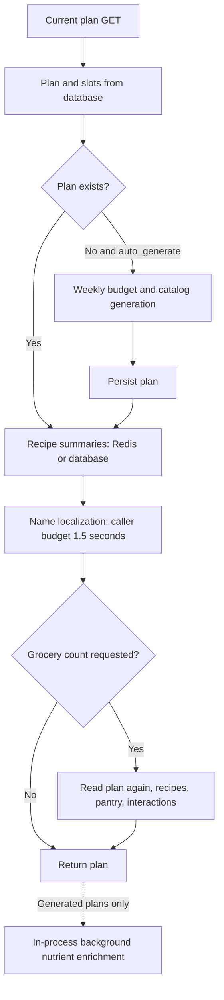

# Meal-plan performance review — 2 October 2026

Backend reviewed first. Scope: current source, endpoint contracts, computation, repository query behavior, external I/O, then the Flutter client. Review only; no application code or deployed configuration changed.

Backend revision: `00b6eaa6`. Live latency, actual catalog size, database geography, provider routing, and worker/pool settings have not been measured. Local experiments below prove computation/query behavior, not production latency.

## Backend endpoint inventory

All weekly-plan and recipe routes are registered in [meal_plans.py](/Users/alexnguyen/Desktop/Nut/mealtrack_backend/src/api/routes/v1/meal_plans.py:106). CQRS `send()` directly awaits the handler; it does not move generation or AI proposals to a worker.

| Endpoint | Work before response | Main performance exposure |
|---|---|---|
| `GET /v1/meal-plans/current` | Resolve week; read plan; recipe summaries; name localization; optional groceries | Defaults `auto_generate=true`, `include_grocery_count=true`. A missing plan adds weekly-budget resolution, generation and persistence. Existing-plan reads still hydrate unused catalog relationships. |
| `POST /v1/meal-plans/generate` | Weekly budget → idempotency → catalog revision + all active recipes → select 14 slots → persist → response projection | Full catalog hydration and CPU selection; response work follows commit. Micronutrients run after response. |
| `PATCH /v1/meal-plans/{id}` | Idempotency → load current → validate recipes/preferences → lock/update → response projection | A single recipe swap loads all active recipes. Count/localization overhead follows persistence. |
| `POST /v1/meal-plans/{id}/ai-prompt` | Load plan, full catalog, profile → provider → validate ≤14 changes → project proposed groceries → localize response | Up to 200 recipe candidates; sequential provider fallback/retries; translation after AI; no aggregate deadline. Proposal is separate from applying it. |
| `GET /v1/meal-plans/{id}/groceries` | Load plan → load recipes → pantry + interaction state → aggregate → localize | Duplicate plan/catalog hydration; cold translation has no route-level aggregate deadline. |
| `PATCH /v1/meal-plans/{id}/groceries` | Validate ≤100 updates → idempotency → lock/load plan → pantry/state writes | Hydrates the full plan graph. Existing pantry/state rows are prefetched, mutations run in memory, and the repository flushes once; bulk DML is a candidate to benchmark, not a confirmed per-ingredient SELECT issue. |
| `POST /v1/meal-plans/{id}/slots/{slot}/log` | Idempotency → lock slot → validate → load recipe → materialize meal → mark logged | Slot lock hydrates unused relationships; lock remains held through meal materialization and writes. |
| `GET /v1/recipes` | Load active recipes → Python filtering/sorting → slice page → localize | `limit=20` caps response, not DB loading/computation. Translates omitted description/summary/equipment/allergen fields. |
| `GET /v1/recipes/{id}` | Load recipe and steps → overlay persisted micronutrients → localize | No USDA/AI nutrient generation, but cold presentation translation can call OpenAI. |
| Deprecated `POST /v1/recipes/{id}/micronutrients/enrich` | Same persisted detail read | Compatibility route does not trigger provider enrichment. |

### Request critical paths

## Ranked backend findings

### 1. High: persisted plan reads fetch a recipe graph that is discarded

[Repository loads slots and pantry](/Users/alexnguyen/Desktop/Nut/mealtrack_backend/src/infra/repositories/weekly_meal_plan_repository_async.py:348). [Slot→catalog uses `lazy="joined"`](/Users/alexnguyen/Desktop/Nut/mealtrack_backend/src/infra/database/models/weekly_meal_planner/weekly_meal_plan_slot.py:44), cascading ingredients, allergens, food references, servings and nutrients. [The plan mapper](/Users/alexnguyen/Desktop/Nut/mealtrack_backend/src/infra/repositories/weekly_meal_plan_repository_async.py:371) retains slot IDs/state, not that recipe graph.

An isolated run of the actual repositories produced **8 SELECTs for a plan read**. Removing unused catalog/pantry loading can make the basic read plan + slots, while preserving explicit recipe-summary hydration separately. Use narrow projections/loader overrides in read operations; mutation paths can request the state they need.

The summary cache does not prevent the first plan read from fetching this hidden graph.

### 2. High: catalog work scales with total catalog size, including one-slot swaps and paginated browsing

[Generation](/Users/alexnguyen/Desktop/Nut/mealtrack_backend/src/app/services/weekly_meal_plan_service.py:93), [slot updates](/Users/alexnguyen/Desktop/Nut/mealtrack_backend/src/app/services/weekly_meal_plan_service.py:186), and [AI proposals](/Users/alexnguyen/Desktop/Nut/mealtrack_backend/src/app/services/weekly_meal_plan_service.py:284) call `list_active_meals()`. [The repository](/Users/alexnguyen/Desktop/Nut/mealtrack_backend/src/infra/repositories/catalog_recipe_repository_async.py:82) loads full rows and ingredient/nutrition relationships, then materializes domain objects. [Nutrition mapping](/Users/alexnguyen/Desktop/Nut/mealtrack_backend/src/infra/repositories/catalog_recipe_repository_async.py:693) also recomputes recipe nutrition across ingredients.

[Recipe browsing](/Users/alexnguyen/Desktop/Nut/mealtrack_backend/src/app/services/weekly_recipe_service.py:79) filters and sorts in Python; pagination happens at line 116. Cuisine/meal type are pushed down, but search/diet/dislikes/time and pagination are not. Each page can reload the same matching catalog.

For swaps, fetch only requested recipes, or the current ≤14 plus replacements when hard preferences change. For browsing, use a dedicated list projection and DB pagination/filtering that preserves existing eligibility semantics. For generation/AI, use compact candidate metadata and fetch full ingredients only when required. Avoid weakening allergy constraints to speed up queries.

Generation checks for an existing confirmed plan **after** catalog loading and selection. Read current state earlier so requests that will conflict do not perform that work. New idempotency keys do not reuse prior computation.

### 3. High for cold non-English reads: unnecessary and serial translation

[List localization](/Users/alexnguyen/Desktop/Nut/mealtrack_backend/src/api/routes/v1/meal_plans.py:341) excludes ingredients, but [the text collector](/Users/alexnguyen/Desktop/Nut/mealtrack_backend/src/app/services/catalog_meal_response_localizer.py:258) still collects description, summary, equipment and allergens. The list response exposes only name/tag among these texts. The collector also handles cooking steps for detail responses, but [the list mapper](/Users/alexnguyen/Desktop/Nut/mealtrack_backend/src/infra/repositories/catalog_recipe_repository_async.py:723) supplies an empty step tuple, so cooking steps do not add translation work to current list requests.

[Translation batches](/Users/alexnguyen/Desktop/Nut/mealtrack_backend/src/app/services/catalog_meal_response_localizer.py:218) run serially. Limits are 128 items / 32 KiB per batch, 4 KiB per item. The adapter permits one repair, and each translation call has an 8-second default timeout: approximately 16 seconds of configured translation allowance per batch. This is a budget, not observed latency. Detail/grocery/list routes have no aggregate localization deadline.

Translate only rendered list fields. Prefer authored/persisted catalog translations shared across processes. Apply a small total presentation deadline and return canonical text when it expires.

[The cache](/Users/alexnguyen/Desktop/Nut/mealtrack_backend/src/app/services/catalog_meal_response_localizer.py:27) holds 4,096 entries for 6 hours **per process**, without in-flight deduplication. [Dependencies](/Users/alexnguyen/Desktop/Nut/mealtrack_backend/src/api/base_dependencies.py:640) wire translation directly to OpenAI, without Redis text caching. The plan's [1.5-second `wait_for`](/Users/alexnguyen/Desktop/Nut/mealtrack_backend/src/api/routes/v1/meal_plans.py:663) can cancel cold work before cache insertion; repeated opens can pay the same timeout. Allow shared work to warm independently of one reader's deadline.

### 4. High for AI adjustments: large prompts and stacked provider budgets

[The proposal adapter](/Users/alexnguyen/Desktop/Nut/mealtrack_backend/src/infra/adapters/weekly_meal_plan_adjustment_provider.py:99) sends the first 200 recipes, even for one slot, requests up to 3,000 output tokens, and uses purpose `general`. It loads the entire catalog first, then truncates the prompt without an application-side eligible shortlist. A poor candidate set can waste a slow provider call before validation rejects the result.

[The manager](/Users/alexnguyen/Desktop/Nut/mealtrack_backend/src/infra/services/ai/ai_model_manager.py:324) attempts models sequentially. Base `general` is OpenAI; configured Cloudflare `general` routing prepends Cloudflare. Defaults: Cloudflare HTTP timeout 60 seconds; OpenAI HTTP timeout 20 seconds with one SDK retry. No aggregate request deadline; these are not strict total ceilings because retry delays/provider internals also apply. **Deployed routing is unverified.**

After generation, [explanation/diff localization](/Users/alexnguyen/Desktop/Nut/mealtrack_backend/src/api/routes/v1/meal_plans.py:431) precedes summary localization. Use a dedicated planner purpose with explicit OpenAI routing, an eligible/ranked shortlist, a tighter output contract, and an aggregate proposal deadline. Preserve the separate review/apply operation.

The AI service releases its DB UoW before provider calls; this path does not hold a DB connection for the entire AI wait.

### 5. Medium/high depending on caller: count badges recompute full groceries

[`_plan_response()`](/Users/alexnguyen/Desktop/Nut/mealtrack_backend/src/api/routes/v1/meal_plans.py:681) dispatches the grocery query solely for a count. [That handler](/Users/alexnguyen/Desktop/Nut/mealtrack_backend/src/app/handlers/query_handlers/meal_planner/weekly_meal_planner_query_handlers.py:86) opens another UoW and reloads the plan. [Grocery calculation](/Users/alexnguyen/Desktop/Nut/mealtrack_backend/src/app/services/weekly_grocery_service.py:65) reloads recipes, pantry and interaction state and constructs all categories.

The current Flutter API explicitly sends `include_grocery_count=false` for GET/generate/update, reducing its exposure. Other callers using defaults pay this cost. Make optional projection intent explicit; calculate counts from already loaded projection data where possible. Cache groceries only with correct invalidation for plan revisions, pantry and grocery interactions.

### 6. Medium, grows with catalog: synchronous selection occupies the serving event loop

[The domain generator](/Users/alexnguyen/Desktop/Nut/mealtrack_backend/src/domain/services/weekly_meal_planner/weekly_plan_generation_service.py:33) filters N recipes, sorts candidates, then scans eligible recipes for each of 14 slots. Repeated title-word regex checks, derived calories and stable hashes add CPU cost. It runs directly inside the async service without yielding, while the generation transaction remains open; an existing plan lock is held during catalog loading/selection.

Local timings below show a material cost at larger catalogs. Precompute stable title eligibility/slot suitability/calories per candidate; preserve matching semantics. Narrow the catalog load first. Evaluate offloading only after measuring deployed event-loop lag and CPU; concurrency alone does not remove computation.

### 7. Medium: optional Redis can delay the response independently of translation

[Summaries await cache MGET, then DB hydration, then cache write](/Users/alexnguyen/Desktop/Nut/mealtrack_backend/src/app/services/weekly_recipe_service.py:138). [Redis defaults](/Users/alexnguyen/Desktop/Nut/mealtrack_backend/src/infra/cache/redis_client.py:35) allow 5-second socket/connection timeouts. A degraded cache read can be followed by another write attempt. The plan's 1.5-second localization budget starts afterward and does not cap Redis time.

Give optional cache work a small total budget and skip writes during cache degradation. Healthy warm summaries already use one batched MGET.

### 8. Medium: conditional pool configuration does not reach the actual engine

[Policy selection](/Users/alexnguyen/Desktop/Nut/mealtrack_backend/src/infra/database/connection_policy.py:140) supports `NEON_POOLER_USE_QUEUE_POOL`. [Engine creation](/Users/alexnguyen/Desktop/Nut/mealtrack_backend/src/infra/database/config_async.py:91) branches on connection mode and omits queue-pool size/overflow/timeout/recycle parameters in Neon mode.

An isolated synthetic config requested size 8 / overflow 4 / timeout 10; the actual pool used size 5 / overflow 10 / timeout 30 / recycle −1 / pre-ping false. Reported policy capacity can differ from actual capacity. Fix argument selection by pool class and assert actual engine settings. **Live pool mode/settings are unverified; this defect is conditional.**

### 9. Capacity concern: post-response micronutrient work competes with API traffic

Generated plans enqueue [FastAPI BackgroundTasks](/Users/alexnguyen/Desktop/Nut/mealtrack_backend/src/api/routes/v1/meal_plans.py:226). It runs after delivering the plan body, in the serving process. PATCH does not enqueue enrichment. Nutrient work is therefore a separate capacity/readiness concern, not an explanation for blocking every persisted read.

[Each invocation creates its own semaphore of four](/Users/alexnguyen/Desktop/Nut/mealtrack_backend/src/app/services/catalog_recipe_micronutrient_enrichment_service.py:151). Each USDA operation can [fan out five requests](/Users/alexnguyen/Desktop/Nut/mealtrack_backend/src/api/dependencies/event_bus.py:335), so a cold plan can reach 20 simultaneous USDA requests; different plans multiply that ceiling. Same-recipe claims reduce duplicate work, but different recipes remain unbounded globally.

Pending recipes [poll every 0.5 seconds with two reads](/Users/alexnguyen/Desktop/Nut/mealtrack_backend/src/app/services/catalog_recipe_micronutrient_enrichment_service.py:185) for up to 90 seconds. Claims expire after 180 seconds; they are obtained before provider admission, so long queue/provider waits can outlive leases. Fencing protects stale writes, not wasted provider work. Use shared admission, backoff/completion notification and bounded lease-aware work; a durable enrichment worker is appropriate if live concurrency justifies it. Preserve explicit current-week generation; do not replace it with scheduled future-week precompute.

## Verified local measurements

### SQL behavior

Actual SQLAlchemy repositories, isolated in-memory SQLite, fresh sessions, 14 slots sharing one active recipe with mapped ingredients and one allergen; below select-in batching thresholds. These counts exclude auth, timezone/budget, Redis, localization, transaction statements and pre-ping. PostgreSQL plans/latency were not measured.

| Operation | SELECT statements |
|---|---:|
| Plan read / plan lock load | 8 |
| Slot lock load | 7 |
| Batched catalog recipes | 6 |
| Grocery handler: plan + grocery calculation | 16 |
| Existing current plan, count enabled, cold/warm summaries | 30 / 24 |
| Existing current plan, count disabled, cold/warm summaries | 14 / 8 |

Route totals combine independently verified counts across the separate handler UoWs. Actual counts vary with missing/empty relations and loader batching; returned rows/bytes grow with recipe diversity even when statement counts stay similar.

### CPU selection

Actual `WeeklyPlanGenerationService.generate()`, Python 3.13.2, synthetic domain objects with eight ingredients, lunch+dinner support and unconstrained preferences. One warm-up plus five measured runs per size; object construction excluded. These are **local CPU timings**, excluding DB/ORM, HTTP, translation and AI.

| Candidate catalog size | Median | Range |
|---|---:|---:|
| 200 | 14.26 ms | 13.65–14.93 ms |
| 1,000 | 72.56 ms | 71.18–79.28 ms |
| 5,000 | 362.33 ms | 360.18–376.31 ms |
| 10,000 | 821.92 ms | 756.22–930.93 ms |

Profile at 10,000: 490,000 title regex searches and 140,000 per-slot score evaluations. Profiling adds overhead; its 1.786-second total is not comparable to the unprofiled medians. Title filtering consumed ~65% of profiled cumulative time; slot selection ~29%.

### Contract/regression checks

- Route/service/generator/AI-adapter selection: **78 passed in 2.42 seconds**.
- Repository/grocery/logging/UoW/pool selection: **80 passed**. The two selections overlap; do not add them as unique test counts.
- Existing tests verify behavior, not live performance. No full-suite, device, production load, or authenticated live endpoint claim is made.

## Measurement and improvement order

1. Record deployed revision and actual catalog size; measure existing vs missing-plan GET separately, English vs Vietnamese, cold vs warm caches, and `include_grocery_count` flags. Use a dedicated test user for any generation or mutation measurements.
2. Capture phase spans: auth, connection checkout, plan query, catalog load/map, selection, budget, Redis read/write, localization, grocery projection, provider attempts, lock/commit and background enrichment. Existing [X-Response-Time logging](/Users/alexnguyen/Desktop/Nut/mealtrack_backend/src/api/middleware/request_logger.py:71) measures response-start time, not background completion or mobile render time.
3. Remove hidden plan hydration and use selected-recipe validation for swaps; then compare query counts/bytes and p50/p95 under realistic concurrency.
4. Translate only rendered fields; persist/share catalog translations and bound presentation time. Avoid stacking read/write cache timeouts.
5. Fix conditional pool settings; verify actual deployed pool before resizing workers. Suitable owner/week and child indexes exist in code; verify live indexes and representative read-only EXPLAIN plans before adding more.
6. Shortlist AI candidates with explicit OpenAI planner routing and an aggregate deadline. Measure attempts/fallback rate and token volume.
7. Bound enrichment across requests; revisit a durable worker only with measured load/readiness needs.

Unresolved measurements: live endpoint/provider percentiles, active catalog rows/bytes, current routing/translation hit rate, pool configuration and lock waits. Concurrent different-key missing-plan creation relies on user/week uniqueness because the row lock only covers existing plans; update-versus-log locking deserves a separate correctness test, not a claimed performance incident.

## Mobile review

Mobile revision: `562bba4b`. Existing unrelated auth edits were preserved. No simulator/device profiling was performed. The current client already disables backend grocery counts, but explicitly enables GET auto-generation ([API flags](/Users/alexnguyen/Desktop/Nut/nutree/nutree_ai/lib/features/recipes/data/weekly_meal_plan_api.dart:15)).

### 1. High: every applied plan starts secondary work, including unchanged replacement lists

[`_applyServerPlan()`](/Users/alexnguyen/Desktop/Nut/nutree/nutree_ai/lib/features/recipes/application/meal_planner_controller.dart:298) launches detail hydration, groceries, and both lunch/dinner replacement lists. These run after setting plan loading false, so initial plan painting is progressive. However, every saved revision starts groceries plus two list calls again, including ordinary swaps with unchanged preferences.

Let **U** be unique plan recipes whose macros are invalid both in summaries and in the local cache. Hydration uses unbounded `Future.wait` for those U recipes, without shared in-flight requests or screen/week cancellation. Current backend summaries include valid macros, so **U is usually zero**; do not assume 14 detail calls on every normal open. Older/incomplete payloads can reach U=14. Result-generation guards prevent some stale application but do not cancel network work already sent. A shared logout interceptor does cancel at logout.

Cache replacement lists by preferences + meal type + language + catalog revision, and fetch on demand when a replacement UI opens. Grocery reads should coalesce by relevant plan/pantry revision. Bound and share detail hydration when it is necessary.

### 2. High: cached recipe text is treated as unusable until micronutrients are ready

[RecipeDetailScreen cache reuse](/Users/alexnguyen/Desktop/Nut/nutree/nutree_ai/lib/features/recipes/presentation/screens/recipe_detail_screen.dart:75) requires detail loaded, matching language, **and `microsEnrichmentLoaded=true`**. When persisted enrichment is incomplete/unavailable, each reopen requests the detail endpoint again even though that endpoint cannot generate missing nutrients.

[The refresh UI](/Users/alexnguyen/Desktop/Nut/nutree/nutree_ai/lib/features/recipes/presentation/screens/recipe_detail_screen.dart:347) can hide cached content during the fetch. Separate text freshness from nutrient readiness. Keep current-language recipe content visible while refreshing nutrients; use bounded readiness refresh/backoff rather than refetching complete translated details on every reopen. Preserve the existing language-change safeguards.

### 3. High for swaps: preview ignores loaded details and grocery projections

[Replacement preview](/Users/alexnguyen/Desktop/Nut/nutree/nutree_ai/lib/features/recipes/application/meal_planner_controller.dart:577) starts new recipe detail, previous recipe detail, and groceries, even when equivalent data has already loaded. Confirmation then PATCHes and restarts the secondary projections.

Reuse current-language recipe detail and revision-valid groceries for previews. Fetch only the changed/uncached recipe. Attach both concurrently started futures to one error-handled await immediately; the current implementation starts groceries and awaits details first, allowing grocery errors to escape before their handler attaches.

### 4. Medium/high: an AI proposal overwrites the full recipe cache with compact summaries

[`sendAiPrompt()` uses `apiRecipes.addAll(...)`](/Users/alexnguyen/Desktop/Nut/nutree/nutree_ai/lib/features/recipes/application/meal_planner_controller.dart:1462). [Those summaries](/Users/alexnguyen/Desktop/Nut/nutree/nutree_ai/lib/features/recipes/data/weekly_meal_plan_api.dart:267) include parsed macro nutrition but empty ingredients, steps and other detail fields; they lack cached micronutrient state. This occurs before acceptance, including proposals subsequently cancelled.

The cache can lose previously loaded details/micros and require a later detail fetch. Because macros remain valid, this does **not** necessarily trigger immediate detail hydration after applying the proposal. Use [the existing summary merge](/Users/alexnguyen/Desktop/Nut/nutree/nutree_ai/lib/features/recipes/application/recipes_catalog_data.dart:20), or proposal-local data, instead of replacing cached full detail.

### 5. Medium: client/provider timeout budgets do not align

[Current/generate/update](/Users/alexnguyen/Desktop/Nut/nutree/nutree_ai/lib/features/recipes/data/weekly_meal_plan_api.dart:15) override receive timeout to 120 seconds. [AI prompt](/Users/alexnguyen/Desktop/Nut/nutree/nutree_ai/lib/features/recipes/data/weekly_meal_plan_api.dart:139) uses the shared [60-second default](/Users/alexnguyen/Desktop/Nut/nutree/nutree_ai/lib/core/constants/app_constants.dart:26). Backend provider retries/fallback plus post-AI localization can exceed that allowance.

Align a backend aggregate proposal budget with the client budget and provide operation-specific loading/retry behavior. Increasing the client timeout alone does not remove latency. POST/PATCH are already excluded from generic automatic retries; safe GETs allow at most two total sends through 401/503 policy.

[Remote Dio connections are nonpersistent](/Users/alexnguyen/Desktop/Nut/nutree/nutree_ai/lib/core/network/dio_factory.dart:35), an intentional edge-idle workaround shared by the entire app. Measure connection setup during meal-plan request bursts before changing that setting, and preserve the original recovery scenario.

### 6. Medium: pantry actions produce a PATCH per action and repeated grocery reads

[Pantry writes](/Users/alexnguyen/Desktop/Nut/nutree/nutree_ai/lib/features/recipes/application/meal_planner_controller.dart:985) queue by ingredient to preserve ordering, but do not coalesce intermediate user values. After all pending writes settle, [groceries refresh](/Users/alexnguyen/Desktop/Nut/nutree/nutree_ai/lib/features/recipes/application/meal_planner_controller.dart:1040) runs. Overlapping actions share the final refresh; separately completed actions each cause one.

N overlapping actions generally cause N PATCHes + one GET; N actions separated by completion cause N PATCHes + N GETs. Consider a short batching window for final ingredient intent using the backend's ≤100-update contract, while preserving Undo, per-ingredient order and optimistic rollback semantics.

### 7. Profiling candidate: broad screen rebuilds

[MealPlannerScreen watches the whole state](/Users/alexnguyen/Desktop/Nut/nutree/nutree_ai/lib/features/recipes/presentation/screens/meal_planner_screen.dart:469). Hydration updates [copy the state per returned detail](/Users/alexnguyen/Desktop/Nut/nutree/nutree_ai/lib/features/recipes/application/meal_planner_controller.dart:345), and pantry/projection updates also notify it. This can rebuild both planner/grocery UI while details complete. [The catalog getter](/Users/alexnguyen/Desktop/Nut/nutree/nutree_ai/lib/features/recipes/application/recipes_catalog_data.dart:18) copies merged maps on every access; [the alternatives sheet](/Users/alexnguyen/Desktop/Nut/nutree/nutree_ai/lib/features/recipes/presentation/widgets/sheets/recipe_alternatives_sheet.dart:109) looks up each candidate and eagerly builds up to 50 cards. Use direct lookups and lazy rendering if measured CPU/frame cost warrants it.

Use selected provider fields/subtree subscriptions if profile-mode measurements show meaningful rebuild cost. Cached network images exist, but rendered image width/height do not specify decode limits. Frame times, image source dimensions, decoded memory and actual jank remain unmeasured; these are lower-confidence optimization candidates.

### Request formulas

Excludes images, auth/token refresh and network retries. U is defined above; P is the number of nonempty recipes requested for preview detail (normally 2, or 1 if the previous slot is empty).

| User action | API requests |
|---|---|
| Cold load of an existing plan | `1 current GET + 1 groceries GET + 2 replacement-list GETs + U detail GETs` = **4 + U** |
| Missing plan via current GET | Same client formula; backend performs generation inside the GET. Empty draft/older 404 contract can add an explicit generate POST. |
| Fresh Home entry within 5 minutes | **0** planner reload calls |
| Ordinary replacement preview + confirmation | `P preview details + 1 preview groceries + 1 PATCH + 1 refreshed groceries + 2 replacement lists + U details` = **5 + P + U**, normally **7 + U** |
| Apply an AI proposal after it has arrived | `1 PATCH + 1 groceries GET + 2 replacement lists + U details` = **4 + U** |
| N overlapping pantry actions | **N PATCHes + 1 grocery GET** after the group settles |
| Reopen detail while micronutrients remain unready | **1 detail GET each reopen** |

Direct planner re-entry with an existing plan ID and app foreground do not themselves check the five-minute TTL; the TTL is consulted on the Home entry action. This avoids requests but can retain stale revisions. Choose an explicit refresh policy that preserves cached-first presentation and correctness.

### Separate correctness concern before expanding cache reuse

The [persistent planner provider](/Users/alexnguyen/Desktop/Nut/nutree/nutree_ai/lib/features/recipes/application/meal_planner_controller.dart:1598) has no authenticated-owner binding. Sign-out invalidates other providers but does not reset this planner; a same-week account switch can reuse previous planner state within the five-minute cache window. Backend ownership checks protect server mutations, but cannot clear locally displayed data. Bind planner/cache lifetime to the authenticated session and invalidate on sign-out/account switch. This is a source-traced concern; no account-switch device reproduction was performed.

### Mobile validation

Isolated focused run: `flutter test --no-pub` for API, planner controller, planner screen and recipe-detail screen — **85 passed**, no source changes. Initial concurrent Flutter runs encountered a native asset build failure and a separate test failure; the isolated rerun passed. These widget/unit checks do not establish device latency or frame performance.

## Recommended first change set

Remove unused ORM hydration, validate only selected recipes on swaps, and narrow/bound localization first. On mobile, reuse replacement lists/projections and keep recipe text caching independent of micronutrient readiness. Correct the AI summary merge and authenticated cache lifetime before expanding cache reuse. Then measure cold/warm endpoint p95, request counts, event-loop delay and device time-to-visible-plan/groceries before selecting deeper CPU/infrastructure work.
